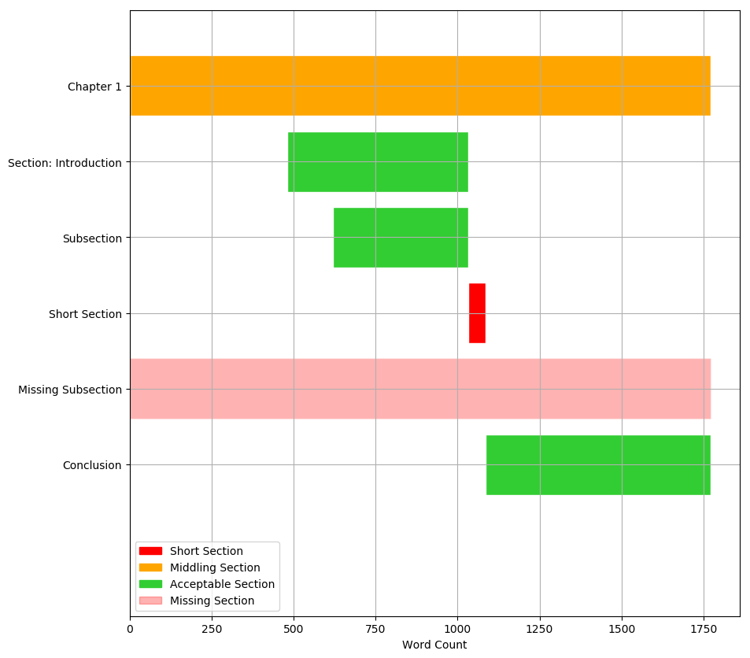

texdiag
=======

texdiag is a python script to produce diagnostics of long tex files, such as academic papers and theses. This includes a word count both overall and broken down by section, a list of all included figures and tex files and a visual representation of the section lengths using a Gantt chart. This is designed to make it easier to find in long tex documents, particularly those that include many different subdocuments, where more text could be added or could be cut.

To use this script download texdiag.py and run either in the python terminal or from the shell using 

```
python texdiag.py examples/example.tex
```

Example Output
--------------



```
-----------------------------------------
SECTION LIST VIEW
=================

------------ Chapter 1  ( 1084  words)
------------------------- Section: Introdu  ( 551  words)
-------------------------------------- Subsection  ( 412  words)
------------------------- Short Section  ( 52  words)
-----------------------------------------
EMPTY SECTIONS:
================
-----------------------------------------

Total Words: 1084.0
Gantt Diagram plotted to texdiag.pdf

-----------------------------------------
```

Use the showempty keyword to show a list of all the empty sections in the document.